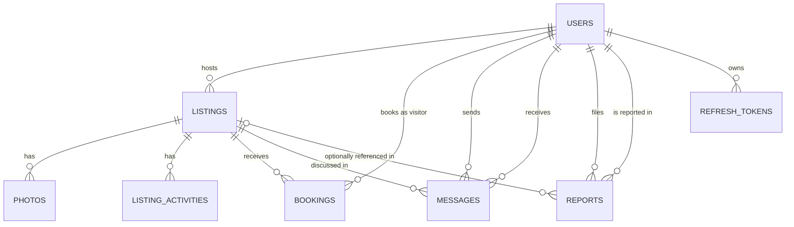

# API Specification — Co-Hosting Platform MVP

Stack: Jakarta EE 10 (JAX-RS, Jakarta Security, CDI) · PostgreSQL + Hibernate · Angular frontend
Base URL: `http://localhost:8080/api/v1` (dev) — versioned under `/api/v1` from day one.

---

## 1. Conventions

**Content-Type:** `application/json; charset=utf-8` for all requests/responses, except photo upload (`multipart/form-data`).

**Authentication:** `Authorization: Bearer <accessToken>` header. Any endpoint marked "Auth: Bearer" returns `401 UNAUTHENTICATED` if the header is missing, malformed, or the token is expired/invalid — this is not repeated per endpoint below.

**IDs:** UUID v4 strings for every resource (`3fa85f64-5717-4562-b3fc-2c963f66afa6`). Avoids ID enumeration on public endpoints like listing browsing.

**Timestamps:** ISO 8601 UTC, e.g. `2026-09-19T14:30:00Z`.

**Architecture layering (what sits behind each endpoint):**
`JAX-RS Resource (controller)` → `CDI Service (business logic, validation, transactions)` → `Repository/DAO (JPA)` → `Entity`.
Resources never serialize JPA entities directly — map to DTOs at the boundary. This matters concretely with Hibernate: a raw entity response will either leak internal fields or throw lazy-initialization exceptions on unfetched associations the moment Jackson tries to serialize them. List endpoints return **summary DTOs** (lighter payload); `GET /{id}` returns **full DTOs**.

**Single-resource responses** are returned raw (not wrapped). **Collection responses** use a standard paginated envelope:
```json
{
  "items": [ ],
  "page": 0,
  "size": 20,
  "totalItems": 137,
  "totalPages": 7
}
```
Query params: `page` (0-indexed, default 0), `size` (default 20, max 100), `sort` (e.g. `sort=createdAt,desc`).

**Standard error envelope** (all 4xx/5xx):
```json
{
  "timestamp": "2026-09-19T14:30:00Z",
  "status": 409,
  "error": "EMAIL_ALREADY_EXISTS",
  "message": "An account with this email already exists",
  "path": "/api/v1/auth/register"
}
```

**Status codes used:**

| Code | Used for |
|---|---|
| 200 OK | Successful GET / PUT / PATCH with a body |
| 201 Created | Successful POST creating a resource |
| 204 No Content | Successful DELETE, or actions with no body to return |
| 400 Bad Request | Validation failure on input |
| 401 Unauthorized | Missing / invalid / expired token (implicit on all Bearer endpoints) |
| 403 Forbidden | Authenticated, but wrong role / not the resource owner / not verified |
| 404 Not Found | Resource doesn't exist |
| 409 Conflict | State conflict (duplicate email, invalid status transition) |
| 500 Internal Server Error | Unhandled — not listed per endpoint |

---

## 2. Roles

| Role | Assigned via |
|---|---|
| `VISITOR` | Public registration |
| `HOST` | Public registration |
| `ADMIN` | **Not self-registerable.** Seeded directly (migration script / initial DB seed), or created by an existing admin out-of-band. There is no public endpoint that issues the ADMIN role. |

---

## 3. Core Resources (data dictionary)

| Entity | Key fields |
|---|---|
| **User** | id, email, fullName, role (`HOST`\|`VISITOR`\|`ADMIN`), verified, blocked, createdAt |
| **Listing** | id, hostId, title, description, city, address, pricePerNight, currency, mealsIncluded, activities[], status (`ACTIVE`\|`HIDDEN`\|`REMOVED`), createdAt |
| **Photo** | id, listingId, url, sortOrder |
| **Booking** | id, listingId, visitorId, checkIn, checkOut, guestsCount, status (`PENDING`\|`CONFIRMED`\|`REJECTED`\|`CANCELLED`), createdAt |
| **Message** | id, listingId, senderId, receiverId, body, sentAt, readAt |
| **Report** | id, reporterId, reportedHostId, listingId (nullable), reason (`SCAM`\|`MISLEADING_LISTING`\|`INAPPROPRIATE_BEHAVIOR`\|`OTHER`), details, status (`OPEN`\|`REVIEWED`\|`DISMISSED`\|`ACTIONED`), adminNotes, createdAt |
| **RefreshToken** | id, userId, tokenHash, expiresAt, createdAt — not in the original list; it's what actually makes `/auth/refresh` and `/auth/logout` in §4 possible |

Passwords are never returned in any response, ever. Full JPA entity code and SQL DDL for all seven entities: §12–§13.

---

## 4. Auth & Account

### `POST /auth/register`
**Auth:** none
Public registration for `HOST` or `VISITOR` only — one unified flow, one `User` table with a `role` field. Do not build separate host/visitor auth systems.

**Request**
```json
{
  "email": "host@example.com",
  "password": "SecurePass123!",
  "fullName": "Youssef El Amrani",
  "role": "HOST"
}
```

**Response `201`**
```json
{
  "id": "7c9e6679-7425-40de-944b-e07fc1f90ae7",
  "email": "host@example.com",
  "fullName": "Youssef El Amrani",
  "role": "HOST",
  "verified": false,
  "createdAt": "2026-09-19T14:30:00Z"
}
```
Side effect: sends a verification email containing a signed, time-limited token.

**Errors**
| Status | Code |
|---|---|
| 400 | `VALIDATION_ERROR` (weak password, invalid email, role not HOST/VISITOR) |
| 409 | `EMAIL_ALREADY_EXISTS` |

---

### `POST /auth/verify-email`
**Auth:** none
**Request:** `{ "token": "eyJhbGciOi..." }`
**Response `200`:** `{ "message": "Email verified successfully" }`
**Errors:** `400 INVALID_OR_EXPIRED_TOKEN`

---

### `POST /auth/resend-verification`
**Auth:** none
**Request:** `{ "email": "host@example.com" }`
**Response `200`:** `{ "message": "Verification email sent" }`
**Errors:** `404 USER_NOT_FOUND`, `409 ALREADY_VERIFIED`
Rate-limit this endpoint — it's a classic spam/abuse vector.

---

### `POST /auth/login`
**Auth:** none
Login succeeds regardless of verification status — verification gates specific *actions*, not the ability to sign in and browse. This is deliberate; see the note at the top of this response.

**Request:** `{ "email": "host@example.com", "password": "SecurePass123!" }`

**Response `200`**
```json
{
  "accessToken": "eyJhbGciOi...",
  "refreshToken": "eyJhbGciOi...",
  "expiresIn": 900,
  "user": {
    "id": "7c9e6679-7425-40de-944b-e07fc1f90ae7",
    "email": "host@example.com",
    "role": "HOST",
    "verified": false
  }
}
```
**Errors:** `401 INVALID_CREDENTIALS`, `403 ACCOUNT_BLOCKED`

---

### `POST /auth/refresh`
**Auth:** none (refresh token carried in body)
**Request:** `{ "refreshToken": "eyJhbGciOi..." }`
**Response `200`:** `{ "accessToken": "eyJhbGciOi...", "expiresIn": 900 }`
**Errors:** `401 INVALID_OR_EXPIRED_REFRESH_TOKEN`

---

### `POST /auth/logout`
**Auth:** Bearer
**Request:** `{ "refreshToken": "eyJhbGciOi..." }`
**Response:** `204`
Requires a server-side refresh-token store (DB table or cache) that this call deletes from — a pure stateless JWT cannot be revoked before it naturally expires. See Open Decisions.

---

### `POST /auth/forgot-password`
**Auth:** none
**Request:** `{ "email": "host@example.com" }`
**Response `200`:** `{ "message": "If that email exists, a reset link was sent" }`
Always return this generic message — never reveal whether the email exists. That's a standard enumeration-prevention practice, not paranoia.

---

### `POST /auth/reset-password`
**Auth:** none
**Request:** `{ "token": "eyJhbGciOi...", "newPassword": "NewSecurePass456!" }`
**Response `200`:** `{ "message": "Password reset successfully" }`
**Errors:** `400 INVALID_OR_EXPIRED_TOKEN`

---

## 5. User Profile

### `GET /users/me`
**Auth:** Bearer (any role)
**Response `200`:** full `User` object (see §3).

### `PUT /users/me`
**Auth:** Bearer
**Request:** `{ "fullName": "Youssef El Amrani", "phone": "+212600000000" }`
Email and password changes are deliberately **not** handled here — separate flows (reset-password for password; a dedicated change-email flow with re-verification if you build it later) so this endpoint can't be used to silently hijack the identity fields.
**Response `200`:** updated `User` object.

---

## 6. Listings

### `POST /listings`
**Auth:** Bearer, role `HOST`
**Request**
```json
{
  "title": "Cozy riad near the medina",
  "description": "Two-bedroom riad, 10 min walk to the stadium.",
  "city": "Tetouan",
  "address": "12 Rue de la Kasbah",
  "pricePerNight": 450.00,
  "currency": "MAD",
  "mealsIncluded": true,
  "activities": ["Airport pickup", "Guided medina tour"]
}
```
**Response `201`:** full `Listing` object, `status` defaults to `ACTIVE`.
**Errors:** `400 VALIDATION_ERROR`, `403 EMAIL_NOT_VERIFIED`

---

### `GET /listings`
**Auth:** none (public)
**Query params:** `city`, `minPrice`, `maxPrice`, `mealsIncluded`, `page`, `size`, `sort`
**Response `200`:** paginated envelope of **summary** DTOs:
```json
{
  "items": [
    {
      "id": "9b1deb4d-3b7d-4bad-9bdd-2b0d7b3dcb6d",
      "title": "Cozy riad near the medina",
      "city": "Tetouan",
      "pricePerNight": 450.00,
      "currency": "MAD",
      "mainPhotoUrl": "https://.../photo1.jpg",
      "hostName": "Youssef El Amrani"
    }
  ],
  "page": 0, "size": 20, "totalItems": 1, "totalPages": 1
}
```

---

### `GET /listings/{id}`
**Auth:** none
**Response `200`:** full `Listing` DTO including `photos[]` and a host summary block.
**Errors:** `404 LISTING_NOT_FOUND`

---

### `PUT /listings/{id}`
**Auth:** Bearer, role `HOST`, must own the listing
Full replace — the frontend submits the complete edited form, not a partial diff.
**Request:** same shape as `POST /listings`.
**Response `200`:** updated `Listing`.
**Errors:** `403 NOT_OWNER`, `404 LISTING_NOT_FOUND`

---

### `DELETE /listings/{id}`
**Auth:** Bearer, role `HOST`, owner
Soft delete — sets `status = REMOVED`, never a hard delete (preserves booking/message history for anything already tied to it).
**Response:** `204`
**Errors:** `403 NOT_OWNER`, `404 LISTING_NOT_FOUND`, `409 CANNOT_DELETE_WITH_ACTIVE_BOOKINGS` (has `PENDING` or `CONFIRMED` bookings)

---

### `GET /listings/mine`
**Auth:** Bearer, role `HOST`
**Response `200`:** paginated list of the host's own listings, any status (so they can see their `HIDDEN`/`REMOVED` ones too).

---

### `POST /listings/{id}/photos`
**Auth:** Bearer, role `HOST`, owner
**Content-Type:** `multipart/form-data`, field name `file`
**Response `201`:** `{ "id": "...", "url": "https://.../photo1.jpg", "sortOrder": 0 }`
**Errors:** `400 INVALID_FILE_TYPE`, `413 FILE_TOO_LARGE`, `403 NOT_OWNER`
Storage backend (local disk vs. object storage) is an infrastructure decision, not an API contract detail — see Open Decisions.

---

### `DELETE /listings/{id}/photos/{photoId}`
**Auth:** Bearer, role `HOST`, owner
**Response:** `204`

---

## 7. Bookings

**Status state machine:**

| From | To | Who | Via |
|---|---|---|---|
| — | `PENDING` | VISITOR | `POST .../bookings` |
| `PENDING` | `CONFIRMED` | HOST (listing owner) | `PATCH .../status` |
| `PENDING` | `REJECTED` | HOST (listing owner) | `PATCH .../status` |
| `PENDING` or `CONFIRMED` | `CANCELLED` | VISITOR (booking owner) | `PATCH .../cancel` |
| `REJECTED`, `CANCELLED` | — | — | terminal, no further transitions |

### `POST /listings/{listingId}/bookings`
**Auth:** Bearer, role `VISITOR`
**Request**
```json
{
  "checkIn": "2030-06-14",
  "checkOut": "2030-06-20",
  "guestsCount": 3,
  "message": "Traveling for the opening match, flexible on exact dates."
}
```
**Response `201`:** `Booking` object, `status: "PENDING"`, includes computed `totalPrice` (`nights × listing.pricePerNight`).
**Errors:** `400 VALIDATION_ERROR` (checkOut ≤ checkIn), `403 EMAIL_NOT_VERIFIED`, `404 LISTING_NOT_FOUND`, `409 LISTING_NOT_ACTIVE`

---

### `GET /bookings/mine`
**Auth:** Bearer, role `VISITOR`
**Response `200`:** paginated bookings made by the current visitor.

### `GET /bookings/received`
**Auth:** Bearer, role `HOST`
**Query params:** `status`, `page`, `size`
**Response `200`:** paginated incoming booking requests across all of the host's listings.

### `GET /bookings/{id}`
**Auth:** Bearer — the visitor who made it, the host who owns the listing, or `ADMIN`
**Response `200`:** full `Booking` detail.
**Errors:** `403 NOT_PARTICIPANT`, `404 BOOKING_NOT_FOUND`

### `PATCH /bookings/{id}/status`
**Auth:** Bearer, role `HOST`, must own the listing
**Request:** `{ "status": "CONFIRMED" }` or `{ "status": "REJECTED", "reason": "Dates no longer available" }`
**Response `200`:** updated `Booking`.
**Side effect:** on `CONFIRMED`, auto-reject every other `PENDING` booking on the same listing whose dates overlap. Otherwise nothing stops two visitors both being told "confirmed" for the same room.
**Errors:** `403 NOT_LISTING_OWNER`, `409 INVALID_STATUS_TRANSITION`

### `PATCH /bookings/{id}/cancel`
**Auth:** Bearer, role `VISITOR`, must own the booking
**Response `200`:** `status → "CANCELLED"`
**Errors:** `409 CANNOT_CANCEL` (already `REJECTED`/`CANCELLED`)

---

## 8. Messaging

Threads are scoped to a listing + the two participants, not a separate freestanding "conversation" entity.

### `POST /listings/{listingId}/messages`
**Auth:** Bearer, participant (visitor asking about the listing, or the host)
**Request:** `{ "body": "Is breakfast included?", "toUserId": "f47ac10b-58cc-4372-a567-0e02b2c3d479" }`
`toUserId` is **required** when the sender is the host (a host may have several visitor threads on the same listing) and ignored when the sender is a visitor (receiver is always resolved to `listing.hostId`).
**Response `201`:** `Message` object.
**Errors:** `400 VALIDATION_ERROR`, `404 LISTING_NOT_FOUND`

### `GET /listings/{listingId}/messages`
**Auth:** Bearer, participant
**Query params:** `withUser` (required if the caller is the host and has more than one visitor thread on this listing), `page`, `size`
**Response `200`:** paginated thread, chronological.

### `GET /messages/conversations`
**Auth:** Bearer
**Response `200`**
```json
{
  "items": [
    {
      "listingId": "9b1deb4d-3b7d-4bad-9bdd-2b0d7b3dcb6d",
      "listingTitle": "Cozy riad near the medina",
      "counterpart": { "id": "f47ac10b-...", "fullName": "Sara Benali" },
      "lastMessage": "Is breakfast included?",
      "lastMessageAt": "2026-09-19T14:30:00Z",
      "unreadCount": 2
    }
  ],
  "page": 0, "size": 20, "totalItems": 1, "totalPages": 1
}
```

---

## 9. Reports

### `POST /reports`
**Auth:** Bearer, role `VISITOR`
**Request**
```json
{
  "reportedHostId": "7c9e6679-7425-40de-944b-e07fc1f90ae7",
  "listingId": "9b1deb4d-3b7d-4bad-9bdd-2b0d7b3dcb6d",
  "reason": "MISLEADING_LISTING",
  "details": "Photos don't match the actual property."
}
```
**Response `201`:** `Report` object, `status: "OPEN"`.
**Errors:** `400 VALIDATION_ERROR`, `404 HOST_NOT_FOUND`

### `GET /admin/reports`
**Auth:** Bearer, role `ADMIN`
**Query params:** `status`, `page`, `size`
**Response `200`:** paginated reports.

### `GET /admin/reports/{id}`
**Auth:** `ADMIN`
**Response `200`:** full report detail, including reporter, reported host, and listing snapshot.

### `PATCH /admin/reports/{id}`
**Auth:** `ADMIN`
**Request:** `{ "status": "ACTIONED", "adminNotes": "Host warned; listing hidden pending review." }`
**Response `200`:** updated `Report`.

---

## 10. Admin — Users

### `GET /admin/users`
**Auth:** `ADMIN`
**Query params:** `role`, `verified`, `blocked`, `search` (name/email), `page`, `size`
**Response `200`:** paginated users.

### `GET /admin/users/{id}`
**Auth:** `ADMIN`
**Response `200`:** full user detail, including a summary of their listing count / report count.

### `PATCH /admin/users/{id}/block`
**Auth:** `ADMIN`
**Request:** `{ "reason": "Multiple verified reports of no-show" }`
**Response `200`:** updated user, `blocked: true`.
**Side effect:** if the blocked user is a `HOST`, all of their `ACTIVE` listings are set to `HIDDEN`. A blocked host with live listings is an inconsistent state, not an edge case to ignore.

### `PATCH /admin/users/{id}/unblock`
**Auth:** `ADMIN`
**Response `200`:** updated user, `blocked: false`. (Listings hidden by the block are **not** auto-restored — the admin re-activates them deliberately, see Open Decisions.)

---

## 11. Health

### `GET /health`
**Auth:** none
**Response `200`:** `{ "status": "UP" }`
Trivial, but you want this before deploying to any free-tier host — it's what uptime checks and deployment platforms poll.

---

## 12. Entities (JPA)

Seven entities, not six. `RefreshToken` wasn't in the original data dictionary, but §4 already commits you to `/auth/refresh` and `/auth/logout` — without a table to persist and revoke refresh tokens, both of those endpoints are unbuildable. Adding it now instead of leaving it as a gap you discover mid-sprint.

A few choices below worth understanding, not just copying:

- **`GenerationType.UUID`** generates the UUID in Java before insert (standard since Jakarta Persistence 3.1 / Jakarta EE 10) — no round-trip to the DB required to get the ID back.
- **`BigDecimal`, never `double`/`float`, for `pricePerNight`.** Binary floating point can't represent most decimal fractions exactly — `0.1 + 0.2` isn't `0.3` in a `double`. For money that's not a rounding curiosity, it's a bug waiting to be found by a recruiter asking "how do you handle currency." `BigDecimal` in Java maps to `NUMERIC(10,2)` in Postgres.
- **`activities` is `@ElementCollection`, not a full entity.** A list of strings owned entirely by the listing doesn't need its own identity or repository — making it a full `Activity` entity would be modeling ceremony with no payoff.
- **Omitted below for brevity, but required to compile:** a no-args constructor (JPA needs one), getters/setters (or pull in Lombok's `@Getter @Setter` to cut the boilerplate), and `equals()`/`hashCode()` implemented off `id` alone — not all fields, which breaks the moment Hibernate hands you a lazy proxy instead of the real object.
- **`@Email`, `@NotBlank`, `@Positive`, `@NotNull`** are Jakarta Bean Validation (`jakarta.validation.constraints.*`), not JPA. They fire when you call `@Valid` on the incoming DTO in a JAX-RS resource method, before anything touches the database — validate at the boundary, don't rely on the DB constraint to be your only line of defense.

### User
```java
@Entity
@Table(name = "users")
public class User {

    @Id
    @GeneratedValue(strategy = GenerationType.UUID)
    private UUID id;

    @Email
    @NotBlank
    @Column(nullable = false, unique = true)
    private String email;

    @NotBlank
    @Column(nullable = false)
    private String passwordHash;

    @NotBlank
    @Column(nullable = false)
    private String fullName;

    private String phone;

    @NotNull
    @Enumerated(EnumType.STRING)
    @Column(nullable = false)
    private Role role;

    @Column(nullable = false)
    private boolean verified = false;

    @Column(nullable = false)
    private boolean blocked = false;

    @Column(nullable = false, updatable = false)
    private Instant createdAt;

    public enum Role { HOST, VISITOR, ADMIN }
}
```

### Listing
```java
@Entity
@Table(name = "listings")
public class Listing {

    @Id
    @GeneratedValue(strategy = GenerationType.UUID)
    private UUID id;

    @ManyToOne(fetch = FetchType.LAZY)
    @JoinColumn(name = "host_id", nullable = false)
    private User host;

    @NotBlank
    @Column(nullable = false)
    private String title;

    @Column(columnDefinition = "TEXT")
    private String description;

    @NotBlank
    @Column(nullable = false)
    private String city;

    private String address;

    @Positive
    @Column(nullable = false, precision = 10, scale = 2)
    private BigDecimal pricePerNight;

    @Column(nullable = false, length = 3)
    private String currency = "MAD";

    @Column(nullable = false)
    private boolean mealsIncluded = false;

    @ElementCollection
    @CollectionTable(name = "listing_activities", joinColumns = @JoinColumn(name = "listing_id"))
    @Column(name = "activity")
    private List<String> activities = new ArrayList<>();

    @Enumerated(EnumType.STRING)
    @Column(nullable = false)
    private Status status = Status.ACTIVE;

    @OneToMany(mappedBy = "listing", cascade = CascadeType.ALL, orphanRemoval = true)
    private List<Photo> photos = new ArrayList<>();

    @Column(nullable = false, updatable = false)
    private Instant createdAt;

    private Instant updatedAt;

    public enum Status { ACTIVE, HIDDEN, REMOVED }
}
```

### Photo
```java
@Entity
@Table(name = "photos")
public class Photo {

    @Id
    @GeneratedValue(strategy = GenerationType.UUID)
    private UUID id;

    @ManyToOne(fetch = FetchType.LAZY)
    @JoinColumn(name = "listing_id", nullable = false)
    private Listing listing;

    @NotBlank
    @Column(nullable = false)
    private String url;

    @Column(nullable = false)
    private int sortOrder = 0;
}
```

### Booking
```java
@Entity
@Table(name = "bookings")
public class Booking {

    @Id
    @GeneratedValue(strategy = GenerationType.UUID)
    private UUID id;

    @ManyToOne(fetch = FetchType.LAZY)
    @JoinColumn(name = "listing_id", nullable = false)
    private Listing listing;

    @ManyToOne(fetch = FetchType.LAZY)
    @JoinColumn(name = "visitor_id", nullable = false)
    private User visitor;

    @NotNull
    @Column(nullable = false)
    private LocalDate checkIn;

    @NotNull
    @Column(nullable = false)
    private LocalDate checkOut;

    @Positive
    @Column(nullable = false)
    private int guestsCount;

    @Enumerated(EnumType.STRING)
    @Column(nullable = false)
    private Status status = Status.PENDING;

    @Column(nullable = false, updatable = false)
    private Instant createdAt;

    private Instant updatedAt;

    public enum Status { PENDING, CONFIRMED, REJECTED, CANCELLED }
}
```

### Message
```java
@Entity
@Table(name = "messages")
public class Message {

    @Id
    @GeneratedValue(strategy = GenerationType.UUID)
    private UUID id;

    @ManyToOne(fetch = FetchType.LAZY)
    @JoinColumn(name = "listing_id", nullable = false)
    private Listing listing;

    @ManyToOne(fetch = FetchType.LAZY)
    @JoinColumn(name = "sender_id", nullable = false)
    private User sender;

    @ManyToOne(fetch = FetchType.LAZY)
    @JoinColumn(name = "receiver_id", nullable = false)
    private User receiver;

    @NotBlank
    @Column(nullable = false, columnDefinition = "TEXT")
    private String body;

    @Column(nullable = false, updatable = false)
    private Instant sentAt;

    private Instant readAt;
}
```

### Report
```java
@Entity
@Table(name = "reports")
public class Report {

    @Id
    @GeneratedValue(strategy = GenerationType.UUID)
    private UUID id;

    @ManyToOne(fetch = FetchType.LAZY)
    @JoinColumn(name = "reporter_id", nullable = false)
    private User reporter;

    @ManyToOne(fetch = FetchType.LAZY)
    @JoinColumn(name = "reported_host_id", nullable = false)
    private User reportedHost;

    @ManyToOne(fetch = FetchType.LAZY)
    @JoinColumn(name = "listing_id")
    private Listing listing;

    @NotNull
    @Enumerated(EnumType.STRING)
    @Column(nullable = false)
    private Reason reason;

    @Column(columnDefinition = "TEXT")
    private String details;

    @Enumerated(EnumType.STRING)
    @Column(nullable = false)
    private Status status = Status.OPEN;

    @Column(columnDefinition = "TEXT")
    private String adminNotes;

    @Column(nullable = false, updatable = false)
    private Instant createdAt;

    private Instant reviewedAt;

    public enum Reason { SCAM, MISLEADING_LISTING, INAPPROPRIATE_BEHAVIOR, OTHER }
    public enum Status { OPEN, REVIEWED, DISMISSED, ACTIONED }
}
```

### RefreshToken
```java
@Entity
@Table(name = "refresh_tokens")
public class RefreshToken {

    @Id
    @GeneratedValue(strategy = GenerationType.UUID)
    private UUID id;

    @ManyToOne(fetch = FetchType.LAZY)
    @JoinColumn(name = "user_id", nullable = false)
    private User user;

    @Column(nullable = false, unique = true, length = 512)
    private String tokenHash;

    @Column(nullable = false)
    private Instant expiresAt;

    @Column(nullable = false, updatable = false)
    private Instant createdAt;
}
```
Store a **hash** of the refresh token, not the raw value — same principle as passwords. A leaked `refresh_tokens` table shouldn't hand out usable tokens.

### Entity Relationships


---

## 13. Database Tables (PostgreSQL DDL)

This is your first Flyway (or Liquibase) migration file, not a script to hand-run once and forget. Don't lean on Hibernate's `hibernate.hbm2ddl.auto=update` past local development — it's convenient solo and a liability the moment two people are changing the schema at once, since it can silently miss or mismatch structural changes instead of failing loudly. Save this as `V1__init.sql` and treat every future schema change as a new versioned migration on top of it.

`gen_random_uuid()` is built into PostgreSQL (13 and later) — no `CREATE EXTENSION` needed.

```sql
CREATE TYPE user_role AS ENUM ('HOST', 'VISITOR', 'ADMIN');
CREATE TYPE listing_status AS ENUM ('ACTIVE', 'HIDDEN', 'REMOVED');
CREATE TYPE booking_status AS ENUM ('PENDING', 'CONFIRMED', 'REJECTED', 'CANCELLED');
CREATE TYPE report_reason AS ENUM ('SCAM', 'MISLEADING_LISTING', 'INAPPROPRIATE_BEHAVIOR', 'OTHER');
CREATE TYPE report_status AS ENUM ('OPEN', 'REVIEWED', 'DISMISSED', 'ACTIONED');

CREATE TABLE users (
    id              UUID PRIMARY KEY DEFAULT gen_random_uuid(),
    email           VARCHAR(255) NOT NULL UNIQUE,
    password_hash   VARCHAR(255) NOT NULL,
    full_name       VARCHAR(255) NOT NULL,
    phone           VARCHAR(30),
    role            user_role NOT NULL,
    verified        BOOLEAN NOT NULL DEFAULT FALSE,
    blocked         BOOLEAN NOT NULL DEFAULT FALSE,
    created_at      TIMESTAMPTZ NOT NULL DEFAULT now()
);

CREATE TABLE listings (
    id                UUID PRIMARY KEY DEFAULT gen_random_uuid(),
    host_id           UUID NOT NULL REFERENCES users(id) ON DELETE CASCADE,
    title             VARCHAR(255) NOT NULL,
    description       TEXT,
    city              VARCHAR(120) NOT NULL,
    address           VARCHAR(255),
    price_per_night   NUMERIC(10,2) NOT NULL CHECK (price_per_night >= 0),
    currency          CHAR(3) NOT NULL DEFAULT 'MAD',
    meals_included    BOOLEAN NOT NULL DEFAULT FALSE,
    status            listing_status NOT NULL DEFAULT 'ACTIVE',
    created_at        TIMESTAMPTZ NOT NULL DEFAULT now(),
    updated_at        TIMESTAMPTZ
);
CREATE INDEX idx_listings_host_id ON listings(host_id);
CREATE INDEX idx_listings_city ON listings(city);
CREATE INDEX idx_listings_status ON listings(status);

CREATE TABLE listing_activities (
    listing_id  UUID NOT NULL REFERENCES listings(id) ON DELETE CASCADE,
    activity    VARCHAR(120) NOT NULL,
    PRIMARY KEY (listing_id, activity)
);

CREATE TABLE photos (
    id          UUID PRIMARY KEY DEFAULT gen_random_uuid(),
    listing_id  UUID NOT NULL REFERENCES listings(id) ON DELETE CASCADE,
    url         VARCHAR(500) NOT NULL,
    sort_order  INT NOT NULL DEFAULT 0
);
CREATE INDEX idx_photos_listing_id ON photos(listing_id);

CREATE TABLE bookings (
    id            UUID PRIMARY KEY DEFAULT gen_random_uuid(),
    listing_id    UUID NOT NULL REFERENCES listings(id) ON DELETE CASCADE,
    visitor_id    UUID NOT NULL REFERENCES users(id) ON DELETE CASCADE,
    check_in      DATE NOT NULL,
    check_out     DATE NOT NULL CHECK (check_out > check_in),
    guests_count  INT NOT NULL CHECK (guests_count > 0),
    status        booking_status NOT NULL DEFAULT 'PENDING',
    created_at    TIMESTAMPTZ NOT NULL DEFAULT now(),
    updated_at    TIMESTAMPTZ
);
CREATE INDEX idx_bookings_listing_id ON bookings(listing_id);
CREATE INDEX idx_bookings_visitor_id ON bookings(visitor_id);
CREATE INDEX idx_bookings_status ON bookings(status);

CREATE TABLE messages (
    id           UUID PRIMARY KEY DEFAULT gen_random_uuid(),
    listing_id   UUID NOT NULL REFERENCES listings(id) ON DELETE CASCADE,
    sender_id    UUID NOT NULL REFERENCES users(id) ON DELETE CASCADE,
    receiver_id  UUID NOT NULL REFERENCES users(id) ON DELETE CASCADE,
    body         TEXT NOT NULL,
    sent_at      TIMESTAMPTZ NOT NULL DEFAULT now(),
    read_at      TIMESTAMPTZ
);
CREATE INDEX idx_messages_listing_id ON messages(listing_id);
CREATE INDEX idx_messages_sender_receiver ON messages(sender_id, receiver_id);

CREATE TABLE reports (
    id                 UUID PRIMARY KEY DEFAULT gen_random_uuid(),
    reporter_id        UUID NOT NULL REFERENCES users(id) ON DELETE CASCADE,
    reported_host_id   UUID NOT NULL REFERENCES users(id) ON DELETE CASCADE,
    listing_id         UUID REFERENCES listings(id) ON DELETE SET NULL,
    reason             report_reason NOT NULL,
    details            TEXT,
    status             report_status NOT NULL DEFAULT 'OPEN',
    admin_notes        TEXT,
    created_at         TIMESTAMPTZ NOT NULL DEFAULT now(),
    reviewed_at        TIMESTAMPTZ
);
CREATE INDEX idx_reports_status ON reports(status);
CREATE INDEX idx_reports_reported_host_id ON reports(reported_host_id);

CREATE TABLE refresh_tokens (
    id          UUID PRIMARY KEY DEFAULT gen_random_uuid(),
    user_id     UUID NOT NULL REFERENCES users(id) ON DELETE CASCADE,
    token_hash  VARCHAR(512) NOT NULL UNIQUE,
    expires_at  TIMESTAMPTZ NOT NULL,
    created_at  TIMESTAMPTZ NOT NULL DEFAULT now()
);
CREATE INDEX idx_refresh_tokens_user_id ON refresh_tokens(user_id);
```

**On the `ON DELETE CASCADE` clauses above:** your application should never actually hard-delete a `users` or `listings` row in normal operation — users get blocked (§10), listings get soft-deleted via `status` (§6). These CASCADE rules are a safety net for manual cleanup or resetting test/seed data, not an invitation to build a hard-delete feature. If you catch yourself writing a raw `DELETE FROM users` in application code, something upstream of that is the actual bug.

---

## 14. Open Decisions You Still Need to Make

These aren't optional footnotes — each one changes actual entity fields or endpoint behavior if you decide differently:

1. **Pricing model.** This spec assumes **per-night** pricing (`pricePerNight × nights = totalPrice`), like Airbnb. If you actually want a flat per-stay price for the tournament window instead, both `Listing` and `Booking` change shape. Decide before you write the JPA entities, not after.
2. **Refresh token storage — now built, confirm you actually want it.** §12–§13 already give you the `RefreshToken` entity and `refresh_tokens` table, so `/auth/refresh` and `/auth/logout` are implementable exactly as specified. The real decision left is whether that's worth the complexity on your timeline: if not, cut `/logout` and `refresh_tokens` entirely, shorten the access token's `expiresIn`, and accept that as your only mitigation instead of building and testing real token revocation under a deadline.
3. **Photo storage backend.** Local disk works for a demo but doesn't survive most free-tier deploys (ephemeral filesystem). Budget time for at least a minimal S3-compatible bucket (Cloudflare R2 / Supabase Storage both have free tiers) if this needs to survive a redeploy.
4. **Unhiding listings after unblock.** Right now, unblocking a host does not automatically re-activate their hidden listings. Fine as a safe default — but decide if that's actually what you want, or if it should be a deliberate second admin action.
5. **Rate limiting.** `/auth/login`, `/auth/resend-verification`, and `/auth/forgot-password` are the three endpoints most likely to get hammered, by accident or on purpose. Even a crude in-memory rate limiter (CDI interceptor + a sliding window per IP/email) is worth having and worth being able to explain in an interview.
6. **Capacity vs. guest count.** `guestsCount` on a booking currently isn't validated against anything — there's no `maxGuests` on `Listing`. Not required for MVP, but a five-minute addition if you want the booking form to make sense.
